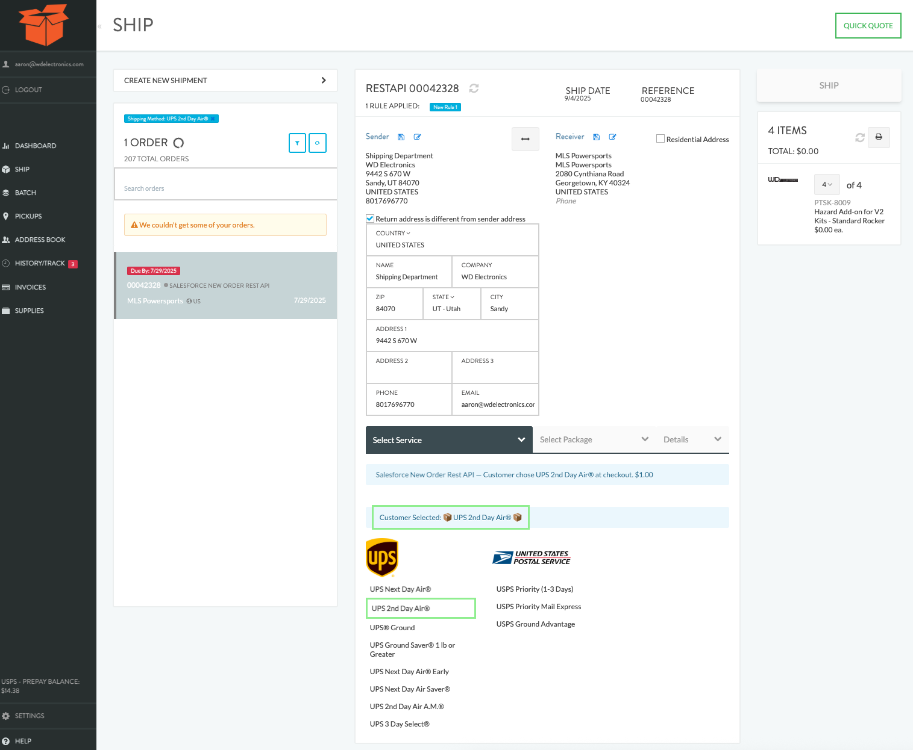

# How to Install
## Load an unpacked extension in Google Chrome

**To load an unpacked extension in developer mode:**

1. [Download the Chrome Extension](https://github.com/flannelware/wd-electronics-chrome-extension/archive/refs/tags/v1.0.0.zip)
2. Unzip on your computer in Documents or some other safe spot it won't be deleted accidentally
3. Open **Google Chrome**
4. Go to the **Extensions** page by entering chrome://extensions in a new tab.
5. Alternatively, click the Extensions menu puzzle button and select Manage Extensions at the bottom of the menu.
Or, click the Chrome menu, hover over More Tools, then select Extensions.
6. Enable Developer Mode by clicking the toggle switch next to Developer mode.
7. Click the Load unpacked button and select the extension directory.

")

Ta-da! The extension has been successfully installed. If no extension icons were included in the manifest, a generic icon will be created for the extension. 

Now, when you go to ShipHaven or England Logistics and click on an order to fulfill it, you will see the selected Shipping Method highlighted in green and the suggested Ship Method to select highlight in green below.

